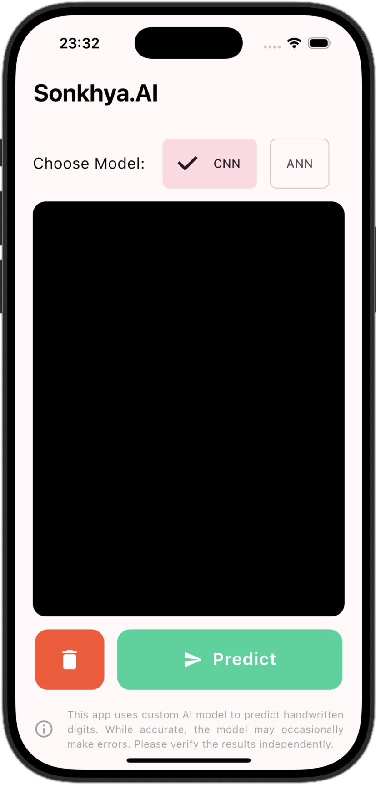
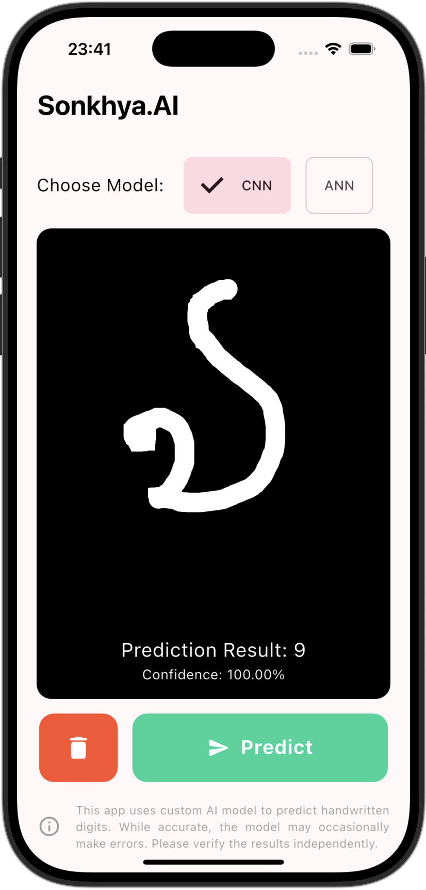
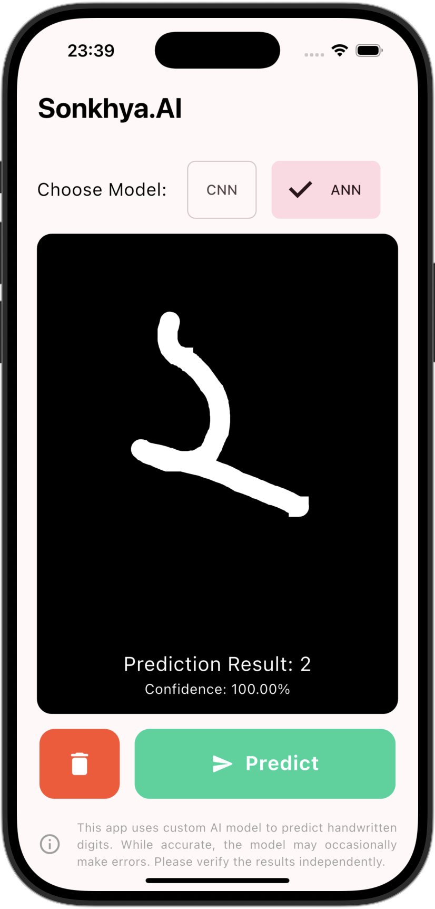

### README.md  

# **Sonkhya&#46;AI: Handwritten Digit Recognition App**  

Sonkhya&#46;AI is a Flutter-based application that uses a custom AI model to predict handwritten **bengali** digits. This app leverages a TensorFlow Lite (TFLite) model to process user-drawn digits on a whiteboard and predict the number with high accuracy.  

## **Features**  
- Interactive drawing board to input handwritten digits.  
- Real-time preprocessing of input images.  
- AI-based prediction using a TFLite CNN model.  
- Simple and clean UI for seamless interaction.  

## **How It Works**  

1. Draw a digit (0-9) on the provided whiteboard canvas in **bengali**.  
2. Tap the **Predict** button.  
3. The app preprocesses the input by:  
   - Converting the image to grayscale.  
   - Resizing the image to 28x28 pixels.  
   - Normalizing pixel values.  
4. The processed image is passed to the TFLite model, which predicts the digit.  
5. The prediction result is displayed on the screen.  
 

## **Screenshots**  

